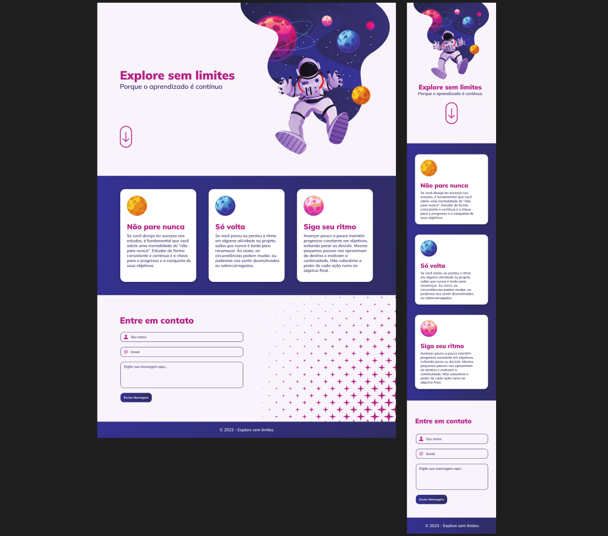

<h1 align="center">Explore sem limites</h1>

  

## 🚀 Tecnologias

Esse projeto foi desenvolvido com as seguintes tecnologias:

- HTML
- CSS

## 💻 Projeto

Um formulario feito com HTML e CSS com o intuito de estudar e rever os conceitos de html5 e css3.

---

Feito com ♥ by Cleber-Risu
